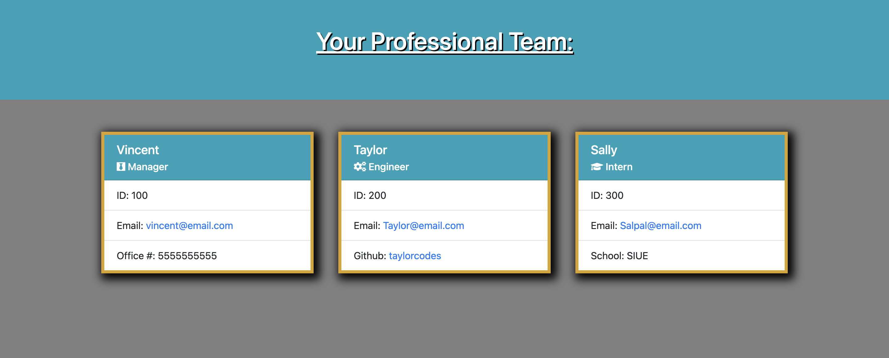
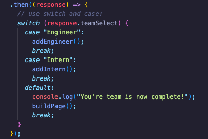
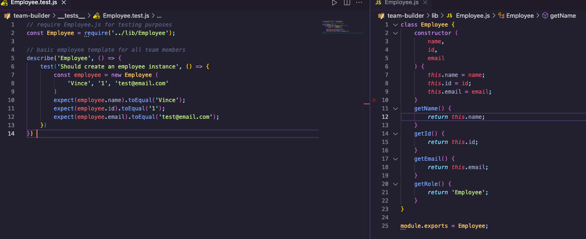
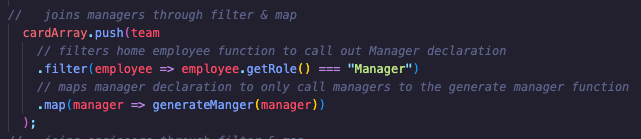
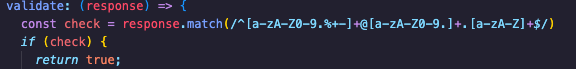

# Team Building Exercise

## License
### 
### [MIT](https://opensource.org/licenses/MIT)

## Description

This node application prompts the user with a series of questions that develop and build a team page for professional tech business.

By: [Vincent Toon](https://github.com/vincenttoon)

## Table of Contents

* [Installation](#installation)

* [Tests](#tests)

* [Usage](#usage)  

* [Things I Learned](#things-i-learned)

* [Contributors](#contributors)

* [Questions?](#questions)

## Installation

* Head to the repository to download or view this code: [Team Building Exercise](https://github.com/Vincenttoon/team-building-exercise)

Download code from repo, run npm i

## Tests

[Video Demonstration](https://drive.google.com/file/d/16I5f2R0BPlmX3okuZAxYcPSQyy-y2EWR/view)

## Usage

* Download or copy this the code from this repo 
* Install node (npm i) 
* Insert your information through the questionnaire
* Enjoy your HTML team page!

## Things I Learned

* How to apply Switch and Case cases from an inquirer prompt to dictate which function happens next: [Switch and Case Link](https://www.digitalocean.com/community/tutorials/how-to-use-the-switch-statement-in-javascript)

* Super usage in Classes through constructor: [Super Link](https://developer.mozilla.org/en-US/docs/Web/JavaScript/Reference/Classes#super_class_calls_with_super)

* Further understanding and application of filter and map:

* Further understanding and application of regex:

## Contributors

* n/a

## Questions?

Questions, comments, or concerns? Please Email me at:
* vincenttoon22@gmail.com
